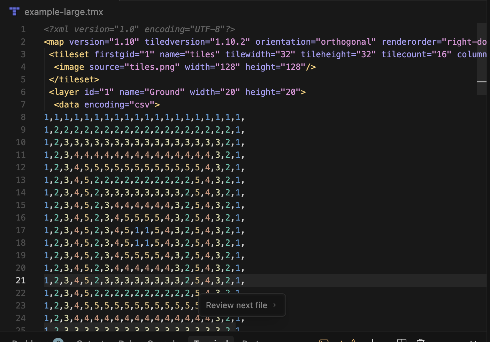
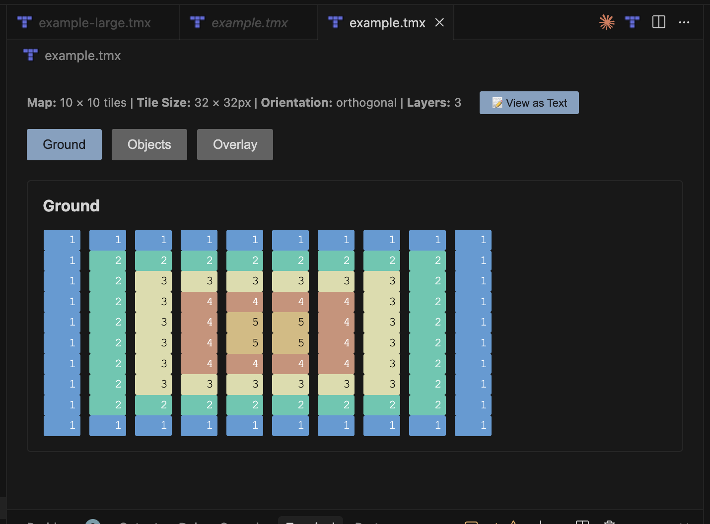

# TILED Map Viewer

A VSCode extension that provides a visual preview of TILED map editor files (.tmx) directly within VSCode, along with syntax highlighting, code completion, and semantic token support.

## Screenshots

### Text Editor View

### Custom Map Viewer

## Features

- 🗺️ **Visual Map Preview** - View your TILED maps directly in VSCode with a custom editor
- 📝 **Syntax Highlighting** - Full TMX syntax highlighting with color-coded elements
- 🎨 **Semantic Token Highlighting** - Color-coded tile numbers and attribute highlighting (defined vs custom attributes)
- 💡 **Code Completion** - IntelliSense for TMX elements and attributes
- 🎯 **Text Editor Decorations** - Tile numbers in CSV data are color-coded by value
- 📊 **Layer Management** - Show/hide individual layers in the visual viewer
- 🔍 **Zoom Controls** - Zoom in/out and reset zoom level
- 🎨 **Multiple Layer Support** - Render all layers with proper opacity
- 📁 **File Format Support** - Supports TMX (XML) format files

## Installation

### From Source

1. Clone this repository
2. Run `npm install` to install dependencies
3. Press `F5` in VSCode to open a new Extension Development Host window
4. In the Extension Development Host, open a `.tmx` file
5. The file will open in the text editor by default with syntax highlighting
6. Use the "Open in TILED Map Viewer" command to view the visual preview

### Building for Distribution

1. Run `npm install`
2. Run `npm run compile` to build the extension
3. Package with `vsce package` (requires [vsce](https://github.com/microsoft/vscode-vsce))

## Usage

### Text Editor (Default)
1. Open a `.tmx` file in VSCode
2. The file opens in the text editor by default with:
   - Syntax highlighting for TMX elements
   - Semantic token highlighting (colored tile numbers and attributes)
   - Code completion for elements and attributes
   - Color-coded tile numbers in CSV data sections

### Visual Map Viewer
1. Open a `.tmx` file in VSCode
2. Click the "Open in TILED Map Viewer" button in the editor title bar, or
3. Right-click the file in the explorer and select "Open in TILED Map Viewer"
4. Use the controls in the viewer:
   - **Zoom**: Use the zoom slider or buttons to adjust zoom level
   - **Layers**: Toggle visibility of individual layers using checkboxes
   - **Reset**: Click "Reset Zoom" to return to 100% zoom
   - **Show Code**: Switch back to the text editor view

## Requirements

- VSCode 1.74.0 or higher
- TILED map files (.tmx format)

## Known Limitations

- Tileset images are loaded via VSCode's file system API, so relative paths should work correctly
- Embedded tilesets (tilesets defined inline in TMX) are supported
- External tileset references (`.tsx` files) are not yet automatically resolved
- Only orthogonal map orientation is fully tested (isometric and hexagonal may work but are not optimized)

## Extension Settings

This extension contributes no settings currently.

## Release Notes

### 0.0.70

Current features:
- Visual map preview with custom editor
- TMX syntax highlighting
- Semantic token highlighting (colored tile numbers and attributes)
- Code completion for TMX elements and attributes
- Text editor decorations for CSV tile data
- Layer visibility toggles
- Zoom controls
- Text editor as default view (custom viewer available via command)

## Contributing

Contributions are welcome! Please feel free to submit a Pull Request.

## License

This extension is provided as-is. TILED is a trademark of Thorbjørn Lindeijer.

